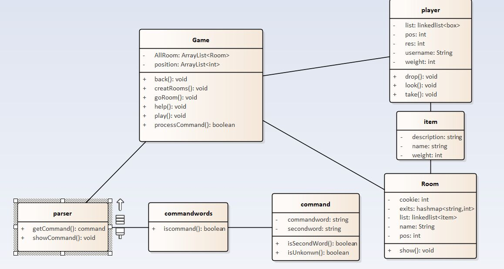

# 软件工程实训任务一：代码规范与标注

##### 1. 代码结构：
    * Game类：实现房间初始化，逻辑交互，及物品，玩家，房间的数据传递
    * Command类：创建并管理逻辑命令
	* CommandWords类：创建并管理词法命令
	* Parser类：创建并调用命令解析器
	* Main类：创建并开始新游戏，程序入口
    * item类：创建并管理物品对象
    * player类：创建并管理玩家对象
	* Room类：创建并管理房间对象
    * testGoAndBack类：测试go与back命令
	* testplayer类：测试player类的方法
	* testrandomRoom类：测试随机传送方法
	* testShow类：测试show命令
##### 2. 命令使用规范：
    > 1. go：去哪？
        >west:向西
        >east：向东
        >north：向北
        >south：向南
	> 2. quit:退出房间
	> 3. help：获取命令帮助
	> 4. show：显示玩家背包物品信息
	> 5. back：退回到上一个房间
	> 6. look：显示当前房间物品信息
	> 7. take：拿起房间物品
        >物品编号：拿起相应编号物品
	> 8. drop：扔掉背包物品
        >物品编号：扔掉相应编号物品   
##### 3. 系统结构

##### 4. 功能扩充项：
    > 1. 一个房间里可以存放任意数量的物件，每个物件有一个描述和一个重量值，玩家进入一个房间后，可以通过“show”命令查看当前房间的信息以及房间内的所有物品信息；
    > 2. 在游戏中使用“back”命令可退回到上一个房间，重复使用它就可以逐层回退几个房间，直到把玩家带回到游戏的起点； 
    > 3. 在游戏中具有传输功能的房间，每当玩家进入这个房间，就会被随机地传输到另一个房间；
    > 4. 在游戏中具有一个独立的Player类用来表示玩家，并具有功能：
    >    * 一个玩家对象保存了玩家的姓名等基本信息，也保存了玩家当前所在的房间；
    >    * 玩家可以随身携带任意数量的物件，但随身物品的总重量不能操过某个上限值；
    >    * 在游戏中新增了两个新的命令“take”和“drop”，使得玩家可以拾取房间内的指定物品或丢弃身上携带的某件或全部物品，当拾取新的物件时超过了玩家可携带的重量上限，系统会提示超重；
    >    * 在游戏中增加一个新的命令“look”, 可以查看玩家随身携带的所有物件及总重量；
    >    * 在某个或某些房间中随机生成一个magic cookie（魔法饼干）物件，并增加一个“eat cookie”命令，如果玩家找到并吃掉魔法饼干，就可以增长玩家的负重能力；
    

